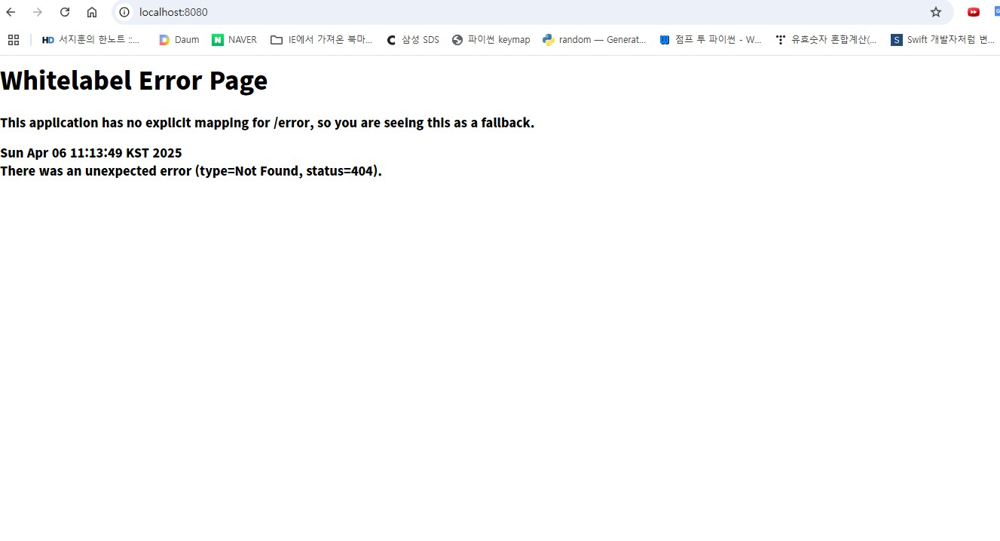

## 2025-1 백엔드 정규 스터디 1주차

- ## 웹
- 클라이언트 : 데이터 생성, 조회, 수정 및 삭제 요청을 전송
- 서버 : 요청대로 동작을 수행하고 응답을 전송

- ## 프로토콜
- 프로토콜 : 네트워크 환경에서 요청과 응답을 보내는 규칙
    - 웹에서는 HTTP라는 프로토콜을 사용한다.
- HTTP를 통해 요청을 보낼 때는 HTTP Method와 URL이 필요하다.
    - HTTP Method : 데이터를 다루는 방법
        - GET : 데이터 조회
        - POST : 데이터 생성
        - PUT : 데이터 교체
        - PATCH : 데이터 수정
        - DELETE : 데이터 삭제
    - URL : 다룰 데이터의 위치. 프로토콜, 서버 주소(domain), 서버 내 데이터 위치(path)로 구성된다.
    - 상태 코드 : 요청에 대한 처리 결과를 나타내는 코드. 응답 데이터의 HTTP 헤더에 포함되어 있다.
        - 200 ok
        - 201 created
        - 400 bad request
        - 404 not found
        - 500 internal server error

- ## API (Application Programming Interface)
- 어플리케이션에서 원하는 기능을 수행하기 위해 어플리케이션과 소통하는 방법을 정의한 것
- API 설계 예시
    - 유저 회원가입 : POST /register
    - 유저 로그인 : POST /login
    - 나의 할 일 생성 : POST /todo
    - 나의 할 일 조회 : GET /todo/{member_id}
    - 나의 할 일 수정 : PATCH /todo/{member_id}
    - 나의 할 일 삭제 : DELETE /todo/{member_id}
    - 나의 할 일 체크 : PATCH /todo/{member_id}/check
    - 나의 할 일 체크 해제 : PATCH /todo/{member_id}/uncheck
    - 친구 찾기 : GET /users/search?query=
    - 친구 팔로우 : POST /users/{member_id}/follow
    - 친구 언팔로우 : DELETE /users/{member_id}/unfollow
    - 나의 친구 리스트 조회 : GET /users/{member_id}/friends
    - 특정 친구의 할 일 조회 : GET /todo/{friend_id}

- ## localhost:8080 접속 페이지
